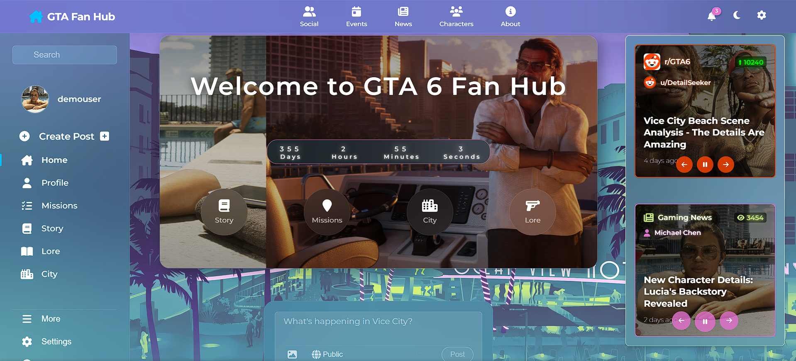
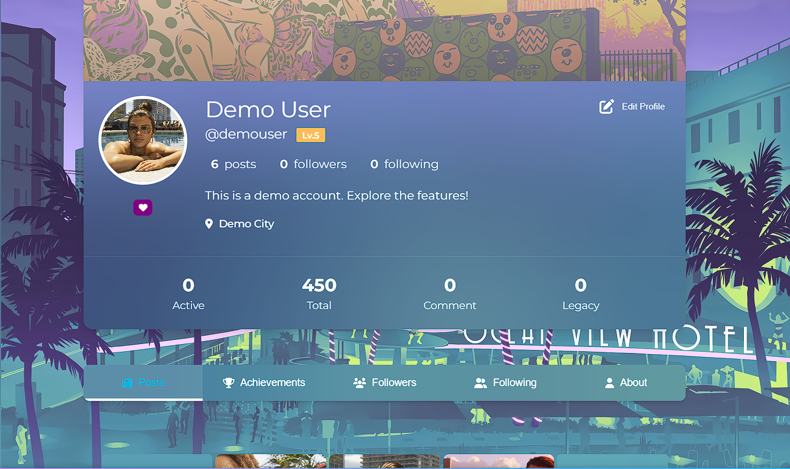
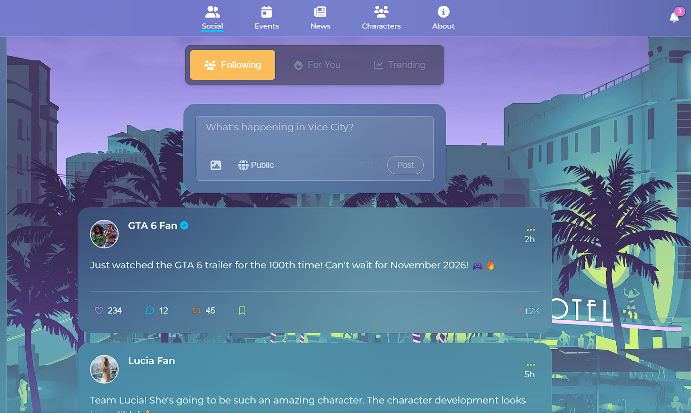
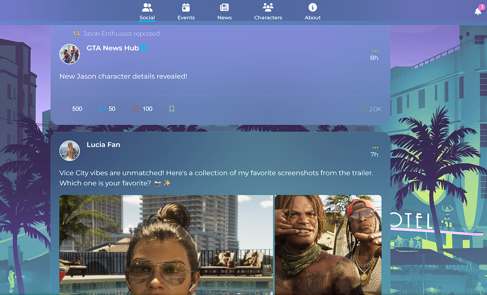
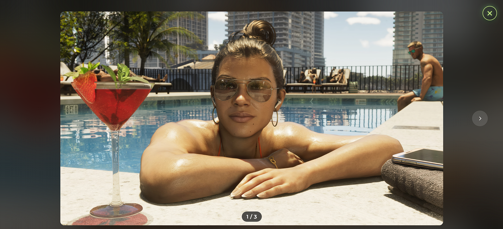
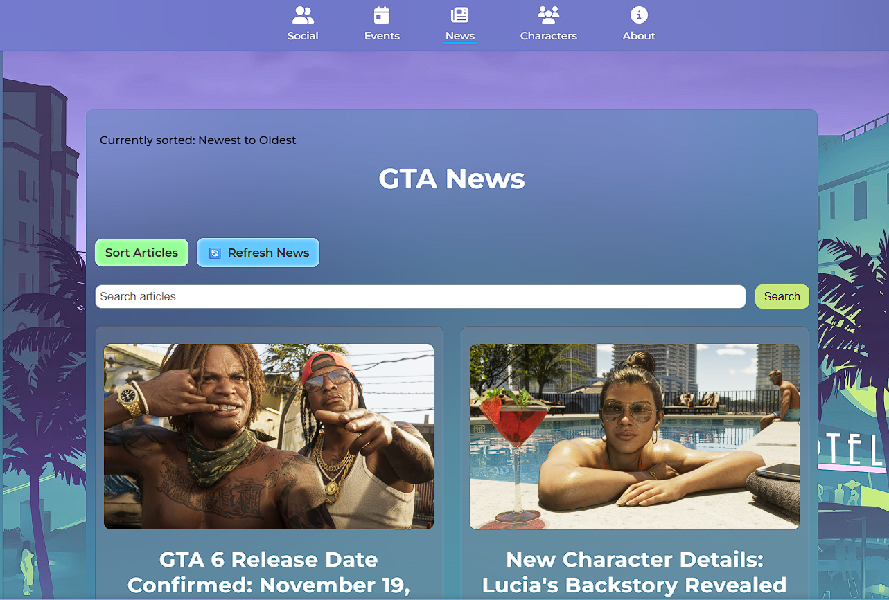
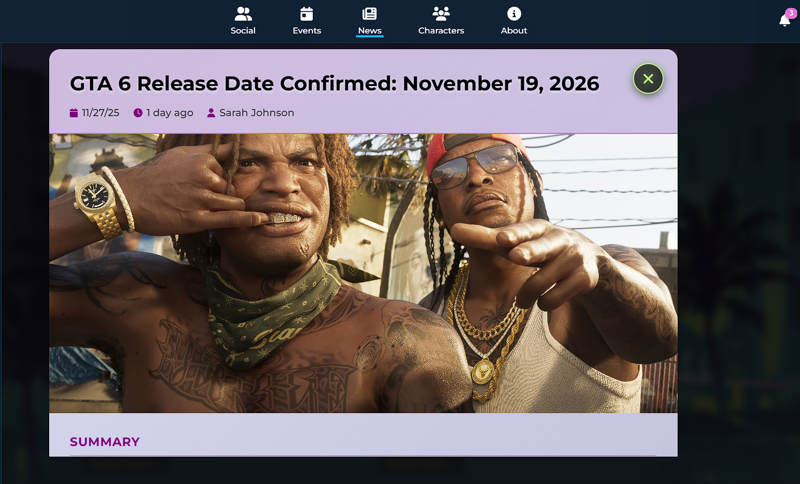
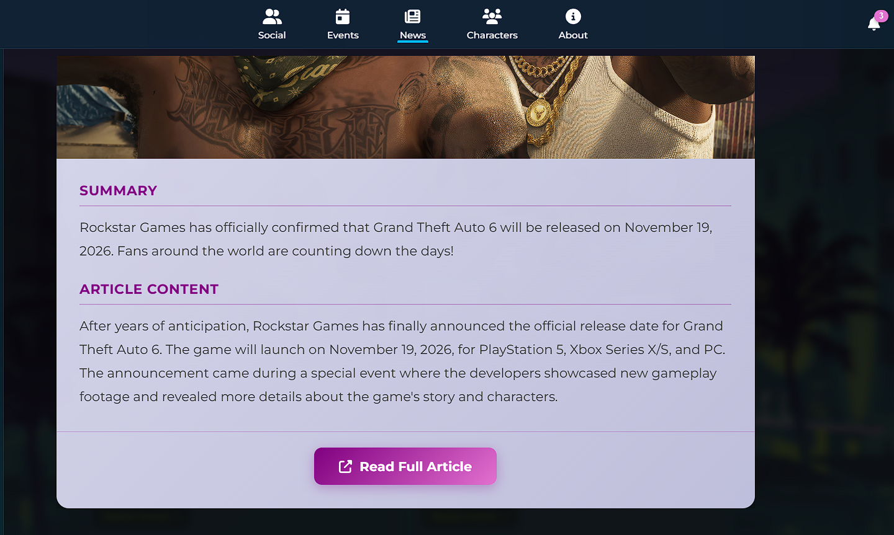
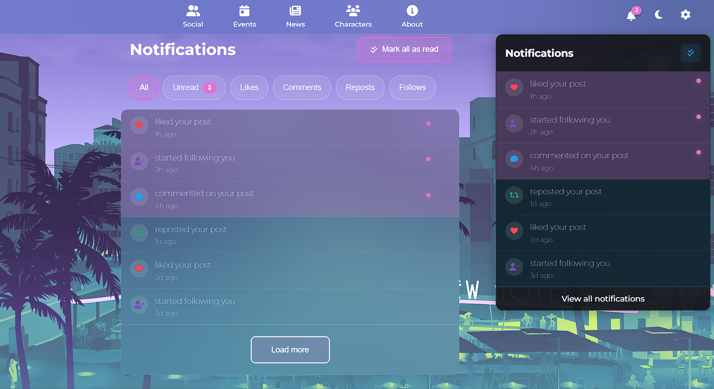

# 🎮 GTA Fan Hub - Demo Beta Preview

**The Ultimate Grand Theft Auto 6 Community Platform**

<a href="https://gta-fan-hub-demo.up.railway.app/" target="_blank" rel="noopener noreferrer">🚀 Try Live Demo</a> • [Report Bug](https://github.com/deziikuoo/GTA-Fan-Hub-Demo/issues) • [Request Feature](https://github.com/deziikuoo/GTA-Fan-Hub-Demo/issues)

---

## ⚠️ Important: Beta Preview Notice

### 🎯 **This is a Demo Beta Preview**

**GTA Fan Hub is currently in active development.** This repository contains documentation and preview materials for the upcoming community platform.

**Please Note:**

- 🚧 **Designs, features, and site structure are subject to change**
- 🔄 The platform is being actively developed and improved
- 📝 What you see here represents our vision, but the final product may differ
- 💡 Your feedback helps shape the future of GTA Fan Hub!

**Want to see it in action?** Check out our [live demo](https://gta-fan-hub-demo.up.railway.app/) hosted on Railway!

---

## 🌟 What is GTA Fan Hub?

**GTA Fan Hub** is a cutting-edge social platform designed exclusively for Grand Theft Auto enthusiasts. We're building a vibrant community where fans can connect, share content, track release dates, and dive deep into the GTA Universe.

### Our Mission

To create the **ultimate destination** for GTA fans worldwide - a place where you can:

- 🤝 **Connect** with fellow GTA enthusiasts
- 📱 **Share** your gameplay, theories, and content
- 📰 **Stay updated** with the latest GTA 6 news and announcements
- 🎮 **Explore** characters, missions, lore, and the GTA universe
- 🏆 **Showcase** your achievements and build your reputation
- 💬 **Engage** in meaningful discussions and build lasting friendships

---

## ✨ Platform Features Preview

### 🏠 **Home Dashboard**

Experience a stunning homepage featuring:

- **Live Countdown Timer**: Real-time countdown to GTA 6 release (November 19, 2026)
- **News Carousel**: Latest GTA 6 news, trailers, and announcements
- **Trending Social Feed**: See what the community is talking about
- **Reddit Integration**: Curated posts from GTA 6 subreddits
- **Interactive UI**: Neon-lit, Vice City-inspired design

### 👤 **User Profiles**

Build your presence in the community:

- **Customizable Profiles**: Upload profile pictures and header images
- **Achievement System**: Showcase your GTA achievements and badges
- **Social Stats**: Track followers, following, posts, and reputation
- **Activity Feed**: View user posts, achievements, and activity
- **Profile Tabs**: Posts, About, Achievements, Followers, Following

### 📱 **Social Features**

Connect and engage with the community:

- **Create Posts**: Share text, images, and media with the community
- **Engagement**: Like, comment, repost, and quote posts
- **Follow System**: Follow other users and build your network
- **Notifications**: Real-time notifications for interactions
- **Feed Filtering**: Filter posts by trending, recent, or following

More Social Feed Screenshots

### 📰 **News & Content**

Stay informed with the latest GTA news:

- **News Aggregator**: Latest GTA 6 news from multiple sources
- **Article Details**: Read full articles with rich formatting
- **RSS Integration**: Automatic news updates
- **Article Carousel**: Featured articles on the homepage

More News Page Screenshots

### 🎯 **Game Content Pages**

Dive deep into the GTA universe:

- **Characters**: Explore GTA 6 characters and their stories
- **Missions**: Mission guides and walkthroughs
- **Story**: Deep dive into the game's narrative
- **Lore**: Comprehensive GTA universe lore
- **City Guide**: Interactive maps of each city in The GTA Series
- **Events**: Community events and game-related activities

### 🔔 **Notifications**

Never miss a beat:

- **Real-time Alerts**: Get notified about likes, comments, follows, and mentions
- **Notification Center**: Centralized notification management
- **Toast Notifications**: Non-intrusive popup notifications
- **Unread Count**: Track unread notifications

### 🎨 **Design & UX**

Experience the Vice City aesthetic:

- **Vice City Aesthetic**: Neon-lit, retro-futuristic design
- **Dark Theme**: Eye-friendly dark mode with vibrant accents
- **Responsive Design**: Works seamlessly on desktop, tablet, and mobile
- **Smooth Animations**: Polished transitions and interactions
- **Accessibility**: WCAG-compliant design patterns

---

## 🎯 About This Demo

This demo showcases the **vision and direction** of GTA Fan Hub. The live demo includes:

### ✅ What You Can Experience

- **Full UI/UX**: Explore all interface elements and design
- **Navigation**: Browse through all pages and features
- **Component Showcase**: See how features will look and feel
- **Responsive Design**: Test on different screen sizes
- **Animations**: Experience smooth transitions and interactions
- **Mock Data**: Comprehensive demo data showing platform capabilities
- **Countdown Timer**: Live countdown to GTA 6 release (November 19, 2026)

### 🚧 Current Limitations (Demo Only)

The live demo uses mock data and static content. The following features are **previewed but not fully functional**:

- Real-time updates and notifications
- User authentication and accounts
- Data persistence (posts, likes, follows)
- File uploads and media sharing
- Live news aggregation
- Backend services and APIs

**Note:** These features are actively being developed for the full release!

---

## 🤝 Join Our Community

We're building GTA Fan Hub **for the community, by the community**. Your participation makes this platform better!

### How to Get Involved

1. **Subscribe to Updates**: Stay informed about GTA Fan Hub development, new features, and community news

   <a href="https://gta-fan-hub-demo.up.railway.app/about#subscribe" style="display: inline-block; padding: 12px 24px; background: linear-gradient(135deg, #4FC08D 0%, #44A08D 100%); color: white; text-decoration: none; border-radius: 5px; font-weight: bold; margin: 10px 0; transition: transform 0.2s, box-shadow 0.2s; box-shadow: 0 4px 6px rgba(79, 192, 141, 0.3);" onmouseover="this.style.transform='scale(1.05)'; this.style.boxShadow='0 6px 12px rgba(79, 192, 141, 0.4)';" onmouseout="this.style.transform='scale(1)'; this.style.boxShadow='0 4px 6px rgba(79, 192, 141, 0.3)';">
      📧 Subscribe to Newsletter
   </a>

2. **Try the Demo**: Experience the platform at our [live demo site](https://gta-fan-hub-demo.up.railway.app/)
3. **Share Feedback**: Report bugs, request features, or share ideas via [GitHub Issues](https://github.com/deziikuoo/GTA-Fan-Hub-Demo/issues)
4. **Stay Updated**: Watch this repository for updates and announcements
5. **Spread the Word**: Share GTA Fan Hub with fellow GTA enthusiasts!

### What We're Looking For

- 💡 **Feature Ideas**: What would you like to see in GTA Fan Hub?
- 🐛 **Bug Reports**: Help us identify issues and improve the platform
- 🎨 **Design Feedback**: Share your thoughts on the UI/UX
- 📝 **Content Suggestions**: What content would be most valuable to you?
- 🌟 **Community Input**: Help shape the future of the platform

**Your voice matters!** Every piece of feedback helps us build a better platform for the GTA community.

---

## 🚀 What's Next?

GTA Fan Hub is actively being developed. Here's what's coming:

### 🔐 **Authentication & Security**

- Full user authentication system
- Secure account management
- Two-factor authentication
- OAuth integration

### 💬 **Real-time Communication**

- Live notifications
- Real-time updates
- Live chat system
- Community messaging

### 📊 **Enhanced Features**

- User analytics dashboard
- Post engagement analytics
- Advanced search and discovery
- Content recommendations

### 🎮 **Gaming Integration**

- Game session tracking
- Achievement system integration
- Leaderboards
- In-game event tracking

### 🛡️ **Community Management**

- Content moderation system
- Report functionality
- Community guidelines
- AI-powered content detection

**And much more!** The platform will continue to evolve based on community needs and feedback.

---

## 🏗️ Technical Overview

GTA Fan Hub is built with modern web technologies:

### Frontend Stack

- **Vue.js 3.5**: Progressive JavaScript framework
- **Vite 6.0**: Next-generation frontend tooling
- **Vue Router 4**: Client-side routing
- **Vuex 4**: State management
- **Sass**: CSS preprocessor
- **Font Awesome**: Icon library

### Architecture

- **Component-Based**: Modular, reusable Vue components
- **Responsive Design**: Mobile-first approach
- **Modern ES6+**: Latest JavaScript features
- **Performance Optimized**: Fast loading and smooth interactions

---

## 🎨 Design Philosophy

GTA Fan Hub embraces the **Vice City aesthetic** with:

- **Neon Accents**: Pink, cyan, and purple neon lights
- **Dark Backgrounds**: Deep blues and purples
- **Art Deco Elements**: Retro-futuristic design language
- **Smooth Animations**: Polished transitions
- **Gaming Aesthetic**: Bold, vibrant, and engaging

---

## 📝 Feedback & Contributions

We welcome your input! Here's how you can help:

### Provide Feedback

- **GitHub Issues**: [Report bugs or request features](https://github.com/deziikuoo/GTA-Fan-Hub-Demo/issues)
- **Feature Requests**: Share your ideas for new features
- **Design Feedback**: Let us know what you think about the UI/UX

### Note on Contributions

This repository currently serves as **documentation and preview materials**. The main development repository is private. However, your feedback and suggestions are invaluable in shaping the platform!

---

## 📞 Contact & Support

- **GitHub Issues**: [Report a bug or request a feature](https://github.com/deziikuoo/GTA-Fan-Hub-Demo/issues)
- **Live Demo**: [Try the demo](https://gta-fan-hub-demo.up.railway.app/)
- **Community**: Join the conversation and help shape GTA Fan Hub!

---

## 🙏 Acknowledgments

- **Rockstar Games** for creating the Grand Theft Auto series
- **Vue.js** community for the amazing framework
- **All GTA fans** who inspire and support this project
- **The community** - this platform is built for you!

---

**Built with ❤️ for the GTA Community**

⭐ **Star this repo if you're excited for GTA 6 and GTA Fan Hub!**

**Join us as we build the ultimate GTA community platform together!**

[⬆ Back to Top](#-gta-fan-hub---demo-beta-preview)

